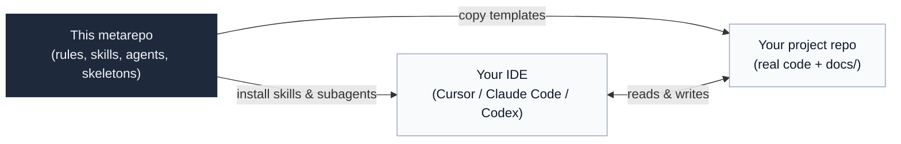
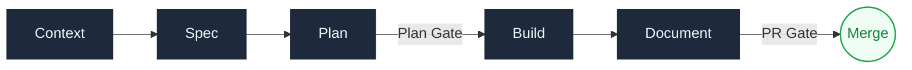

# AI Coding Assistant — Eurostars Data Science

The operating system for AI-assisted Data Science and Data Engineering work.
Rules, templates, workflows and role profiles that keep AI's speed without sacrificing review quality.


## TL;DR

- This is **not application code**. It's a *metarepo*: rules, skills, subagents and document skeletons.
- You **copy a small kit** into your project repo and **reference** the rest from your IDE.
- The result: requirements before building, plans before coding, small reviewable slices, docs that don't rot.

> [!IMPORTANT]
> **The core of this framework is the development cycle** — load the right context at each phase, then follow Context → Spec → Plan → Build → Document. That is what you must adopt.
>
> Skills and subagents are automation on top of that cycle, currently in an exploration phase. Use them if they help, but don't depend on them as a foundation.

---

## Table of contents

- [AI Coding Assistant — Eurostars Data Science](#ai-coding-assistant--eurostars-data-science)
  - [TL;DR](#tldr)
  - [Table of contents](#table-of-contents)
  - [What it solves](#what-it-solves)
  - [Metarepo vs. project repo](#metarepo-vs-project-repo)
  - [The development cycle](#the-development-cycle)
  - [Repository structure](#repository-structure)
  - [Adoption](#adoption)
    - [Track 1 — Project repo setup](#track-1--project-repo-setup)
    - [Track 2 — Developer IDE setup](#track-2--developer-ide-setup)
  - [FAQ](#faq)
  - [Contributing](#contributing)
  - [Maintainers](#maintainers)

---

## What it solves

Without guardrails, AI-assisted work tends to produce large diffs from fuzzy requirements, where tests only run locally and docs are updated weeks later — if at all. Reviewers spend their time reconstructing intent rather than evaluating decisions.

This framework adds the minimum scaffolding to keep AI speed honest:

| | Without the framework | With the framework |
|---|---|---|
| **PR shape** | One 800-line diff | Three ~80-line slices |
| **Reviewer's starting point** | Reads code to guess the design | Reads spec + plan + evidence |
| **Tests** | "It runs on my machine" | Named, reproducible, scoped |
| **Docs** | Drift silently | Updated as part of the cycle |
| **AI instructions** | Scattered across files | One entrypoint (`AGENTS.md`) |

The goal is not process for its own sake. It's **making AI-assisted work reviewable** without slowing it down.

---

## Metarepo vs. project repo



| What | Where it goes | How |
|---|---|---|
| `agent-kit/` (rules + skeletons) | **Committed** into the project repo | Copy once, evolve in-repo |
| `skills/` (AI workflows) | **Installed** in each dev's IDE | Referenced, not copied |
| `subagents/` (role profiles) | **Installed** in each dev's IDE | Loaded on demand |
| `guides/` (theory + onboarding) | **Read by humans** | Never copied |

<details>
<summary><strong>Quick glossary</strong> (click to expand)</summary>

- **Plan Gate**: checklist that validates a plan before Build starts.
- **PR Gate**: checklist that validates documentation before merge.
- **Vertical slice**: a minimal end-to-end chunk of a feature (data → logic → output) rather than one full layer.
- **AI entrypoint**: the single file (`AGENTS.md`) your IDE treats as project instructions.

</details>

---

## The development cycle

Five phases, two validation gates. Full reference in [`guides/onboarding/lifecycle.md`](./guides/onboarding/lifecycle.md).



| Phase | What you do | Typical artefacts |
|---|---|---|
| **Context** | Read `AGENTS.md`, glossary, and project docs so the AI has accurate grounding | `AGENTS.md`, `docs/context/project.md`, glossary |
| **Spec** | Define what must change, why, and what done looks like — before touching code | `docs/features/<feature>/requirements.md` |
| **Plan** | Decide how to implement, slice, test, and document — passes the **Plan Gate** before Build | `design.md`, `tasks.md` |
| **Build** | Implement in small, reviewable slices with evidence (test output, notebook runs) | code, tests, notebook outputs |
| **Document** | Update every durable doc your change touched — passes the **PR Gate** before merge | glossary, CHANGELOG, business report |

**Non-negotiable rule:** lightweight work can skip phases, but you must name what you skip and why — usually in the PR description or `CHANGELOG.md`.

Both gates are short checklists: [`plan-gate`](./skills/utils-skills/plan-gate/SKILL.md) and [`pr-gate`](./skills/utils-skills/pr-gate/SKILL.md). Failing one means looping back, not pushing forward.

---

## Repository structure

| Folder | Purpose | Entry point |
|---|---|---|
| [`agent-kit/`](./agent-kit/) | Kit committed into target repos: `AGENTS.md` template, rules, doc skeletons | [`agent-kit/AGENTS.md`](./agent-kit/AGENTS.md) |
| [`skills/`](./skills/) | Reusable AI workflows (slash commands), grouped by family | [`skills/README.md`](./skills/README.md) |
| [`subagents/`](./subagents/) | Role-based agent profiles: DE, DS, DA, and review | [`subagents/README.md`](./subagents/README.md) |
| [`guides/`](./guides/) | Theory and onboarding for humans — read, not copied | [`guides/onboarding/lifecycle.md`](./guides/onboarding/lifecycle.md) |

---

## Adoption

Two parallel tracks: set up the project repo once, and set up each developer's IDE once.

### Track 1 — Project repo setup

1. **Copy** `agent-kit/` into the project repo root.
2. **Create** a root `AGENTS.md` from [`agent-kit/AGENTS.md`](./agent-kit/AGENTS.md).
3. **Instantiate** the base docs from [`agent-kit/skeletons/`](./agent-kit/skeletons/) into `docs/`: `architecture.md`, `database.md`, `docs-guide.md`, `glossary.md`, `context/project.md`.
4. **Per feature**, create `docs/features/<feature>/` with `requirements.md`, `design.md`, `tasks.md`, `CHANGELOG.md`. Add `report.md` only when the cycle closes.

Resulting repo shape:

```text
repo-root/
├── AGENTS.md                    ← from agent-kit/AGENTS.md
├── agent-kit/                   ← copied from this metarepo
└── docs/
    ├── architecture.md
    ├── database.md
    ├── glossary.md
    ├── context/project.md
    └── features/<feature>/
        ├── requirements.md
        ├── design.md
        ├── tasks.md
        └── CHANGELOG.md
```

### Track 2 — Developer IDE setup

Each developer installs their preferred tool and points it at the skills and subagents in this metarepo. They are **referenced, not copied** — updates here reach everyone automatically.

Full details: [`guides/onboarding/ai-configuration.md`](./guides/onboarding/ai-configuration.md).

| Tool | Project instructions | Skills path | Subagents path |
|---|---|---|---|
| Claude Code | `CLAUDE.md` or `AGENTS.md` | `.claude/skills/` | `.claude/agents/` |
| Cursor | `.cursor/rules/` or `AGENTS.md` | `.cursor/skills/` | `.cursor/agents/` |
| Codex | `AGENTS.md` | `.agents/skills/` | `.codex/agents/` |

---

## FAQ

<details>
<summary><strong>Do I also need to copy <code>skills/</code> into my repo?</strong></summary>

No. `skills/` and `subagents/` are referenced from the IDE — they don't travel to the project repo. Only `agent-kit/` gets copied.

</details>

<details>
<summary><strong>What if my feature is trivial? Do I still run all 5 phases?</strong></summary>

No. You can skip phases, but you must say explicitly what you skipped and why — usually in the PR description or `CHANGELOG.md`.

</details>

<details>
<summary><strong>Does it work if the team uses different IDEs?</strong></summary>

Yes. `AGENTS.md` is the shared entrypoint. Each IDE may also read its own file (`CLAUDE.md`, `.cursor/rules/`), but `AGENTS.md` is the source of truth.

</details>

<details>
<summary><strong>Does this replace human code review?</strong></summary>

No. It makes review more efficient: the reviewer arrives with spec, plan and evidence already aligned. Judgment on architecture, risk and trade-offs stays human.

</details>

<details>
<summary><strong>What if a rule gets in the way?</strong></summary>

Remove it. The goal is a framework that helps the team work better. Rules that don't meet that bar should not stay.

</details>

---

## Contributing

1. Open an issue describing the problem or the improvement you want to make.
2. For new rules or skills, include at least one real example where the addition would have changed an outcome.
3. Keep PRs small and focused — the framework preaches this; we should practice it.
4. If you modify a skill, test it end-to-end in your IDE before opening the PR.

---

## Maintainers

Maintained by the **Eurostars Data Science** team. For questions, reach out through internal channels.

For redistribution outside the Eurostars Group, consult the legal team before proceeding.
