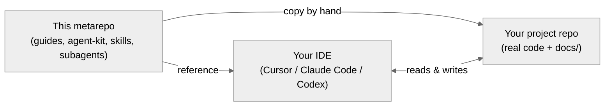

# EHC Agent Harness

Guides, rules and templates that make AI-assisted Data Science and Data Engineering work reproducible, reviewable and documented — without losing speed.

  

---

## A metarepo, not a project

This repository is **not** application code. It is a **metarepo**: a single source of guides, rules, templates and (early) automations that other repositories and developers draw from. Three different audiences pull different parts of it.



| Folder                                                              | Audience                | How it is consumed                              | Status              |
| ------------------------------------------------------------------- | ----------------------- | ----------------------------------------------- | ------------------- |
| [`guides/`](./guides/)                                              | Developers learning     | Read in place. Never copied.                    | Stable              |
| [`agent-kit/`](./agent-kit/)                                        | Project repositories    | Copied **by hand** into the project repo root.  | Stable (manual)     |
| [`skills/`](./skills/)                                              | Developers' IDEs        | Referenced from the IDE.                        | Experimental        |
| [`subagents/`](./subagents/)                                        | Developers' IDEs        | Referenced from the IDE.                        | Experimental        |

> [!IMPORTANT]
> The **stable core** is the development cycle plus the `agent-kit/` that lives in every project repo. That is what you are expected to adopt. Skills and subagents are automation on top of that core — useful, but still being validated.

> [!WARNING]
> There is **no installer** yet. Today, `agent-kit/` is copied into the project repo manually, and skills/subagents are configured per developer in their IDE. Automation is on the [roadmap](#roadmap).

---

## The development cycle

Five phases, three human review checkpoints. The stable core of the framework. Full reference in [`guides/onboarding/lifecycle.md`](./guides/onboarding/lifecycle.md).


### Phases

| Phase        | What you do                                                                                  | Typical artefacts                                  |
| ------------ | -------------------------------------------------------------------------------------------- | -------------------------------------------------- |
| **Context**  | Load `AGENTS.md` and project docs so the AI is grounded, not guessing.                       | `AGENTS.md`, `docs/context/project.md`, glossary   |
| **Spec**     | Define what changes, why, and what "done" looks like — before touching code.                 | `docs/features/<feature>/requirements.md`          |
| **Plan**     | Decide how to slice, test and document.                                                      | `design.md`, `tasks.md`                            |
| **Build**    | Ship small, reviewable slices with evidence (test runs, notebook output).                    | code, tests, notebook outputs                      |
| **Document** | Update every durable doc the change touched.                                                 | glossary, CHANGELOG, business report               |

### Human review checkpoints

Three points where a person — not the AI — has to approve before work continues. The cycle does not move past a checkpoint without sign-off.

| Checkpoint        | What is reviewed                                                | Who                          |
| ----------------- | --------------------------------------------------------------- | ---------------------------- |
| **Spec Review**   | `requirements.md` — scope, acceptance criteria, business rules. | Domain expert or lead        |
| **Plan Review**   | `design.md` + `tasks.md` — approach, slices, evidence strategy. | Technical lead               |
| **PR Review**     | PR diff, tests and updated docs.                                | Reviewer assigned to the PR  |

**Non-negotiable rule:** lightweight work may skip phases, but the skipped ones must be named explicitly — usually in the PR description or `CHANGELOG.md`.

---

## Adoption

Two parallel tracks: set up the project repo once, and set up each developer's IDE once. Both are manual today.

### Track 1 — Project repo (manual)

1. Copy [`agent-kit/`](./agent-kit/) into the project repo root (`cp -r`, drag-and-drop or `git subtree` — your call).
2. Create a root `AGENTS.md` from the [`agent-kit/AGENTS.md`](./agent-kit/AGENTS.md) template and adapt it to the project.
3. Instantiate the base docs from [`agent-kit/skeletons/`](./agent-kit/skeletons/) into `docs/`: `architecture.md`, `database.md`, `docs-guide.md`, `glossary.md`, `context/project.md`.
4. Per feature, create `docs/features/<feature>/` with `requirements.md`, `design.md`, `tasks.md`, `CHANGELOG.md`. Add `report.md` only when the cycle closes.

Resulting repo shape:

```text
repo-root/
├── AGENTS.md                    ← from agent-kit/AGENTS.md template
├── agent-kit/                   ← copied from this metarepo
└── docs/
    ├── architecture.md
    ├── database.md
    ├── glossary.md
    ├── context/project.md
    └── features/<feature>/
        ├── requirements.md
        ├── design.md
        ├── tasks.md
        └── CHANGELOG.md
```

> [!NOTE]
> Only `agent-kit/` is copied into the project repo (the root `AGENTS.md` is generated from its template in step 2). `skills/` and `subagents/` stay in this metarepo and are referenced from the IDE.

### Track 2 — Developer IDE (optional, experimental)

Each developer points their IDE at the skills and subagents in this metarepo. They are **referenced, not copied** — updates here reach everyone automatically.

Full details in [`guides/onboarding/ai-configuration.md`](./guides/onboarding/ai-configuration.md).

| Tool          | Project instructions                               | Skills path                        | Subagents path                  |
| ------------- | -------------------------------------------------- | ---------------------------------- | ------------------------------- |
| Claude Code   | `CLAUDE.md` or `AGENTS.md`                         | `.claude/skills/`                  | `.claude/agents/`               |
| Cursor 2.4+   | `AGENTS.md` or `.cursor/rules/`                    | `.cursor/skills/`                  | `.cursor/agents/`               |
| Codex CLI     | `AGENTS.md` (root) + `~/.codex/AGENTS.md` (global) | — (no native skills directory)     | — (use Agents SDK, out of repo) |

> [!NOTE]
> `AGENTS.md` is the shared, cross-tool entrypoint — now an open standard adopted across Codex, Cursor, Claude Code, Gemini CLI and others. Codex does not natively support a skills or subagents directory; its agent extensibility lives in the separate Agents SDK.
> The Cursor plugin includes a minimal `rules/entrypoint.mdc` rule that points back to `agent-kit/AGENTS.md`; the kit remains the canonical source.

---

## Repository map and glossary

```text
this-metarepo/
├── guides/         ← theory, onboarding, cycle in detail (stable)
├── agent-kit/      ← rules + doc skeletons + AGENTS.md template (stable, manual copy)
├── skills/         ← slash-command workflows for your IDE (experimental)
└── subagents/      ← role profiles for your IDE (experimental)
```

<details>
<summary><strong>Quick glossary</strong></summary>

- **Coding agent** — an LLM-driven tool (Claude Code, Cursor, Codex) that reads and edits the repo.
- **Context engineering** — the practice of deliberately controlling what an agent sees, so its output is grounded.
- **SDD (Spec-Driven Development)** — writing the spec before writing the code, so the agent has something to be measured against.
- **AI entrypoint** — the instruction entry your IDE treats as project guidance. For portable project repos this is `AGENTS.md`; for Cursor, the plugin's `rules/entrypoint.mdc` points back to `agent-kit/AGENTS.md`.
- **agent-kit** — the bundle of rules, doc skeletons and the `AGENTS.md` template (this repo's `agent-kit/`) that gets copied into a project repo.
- **Vertical slice** — a minimal end-to-end chunk of a feature (data → logic → output) rather than one full layer.

</details>

---

## Roadmap

**Stable, use today**

- [x] The guides
- [x] The development cycle
- [x] `agent-kit/` as reference template

**Experimental, expect changes**

- [ ] `skills/` — naming, selection and scope still being tuned with real use
- [ ] `subagents/` — role profiles still being tuned with real use

**Not built yet**

- [ ] CLI plugin to register skills and subagents in one step
- [ ] Automatic delivery of `agent-kit/` into a target repo
- [ ] Versioning between this metarepo and the repos that consume it

Contributions welcome — see [Contributing](#contributing).

---

## FAQ

<details>
<summary><strong>Is this production-ready?</strong></summary>

The **guides and the cycle** are — apply them today regardless of which AI tool you use. The **harness and the installation flow** are not. Read first, copy `agent-kit/` second, tinker with skills third.

</details>

<details>
<summary><strong>What if my feature is trivial? Do I still run all five phases?</strong></summary>

No. You may skip phases, but you must state explicitly what you skipped and why — usually in the PR description or `CHANGELOG.md`.

</details>

<details>
<summary><strong>Does it work if the team uses different IDEs?</strong></summary>

Yes. `AGENTS.md` is the shared source of truth (now an open standard adopted across Codex, Cursor, Claude Code, Gemini CLI and others). Each IDE may also read its own file (`CLAUDE.md`, `.cursor/rules/`), but `AGENTS.md` is the canonical entrypoint.

</details>

<details>
<summary><strong>Does this replace human code review?</strong></summary>

No. The cycle has three explicit human review checkpoints (Spec, Plan, PR) precisely because architecture, risk and trade-off calls stay human.

</details>

---

## Contributing

1. Open an issue describing the problem or the improvement, especially for roadmap items.
2. New rules or skills must include at least one real example where the addition would have changed an outcome.
3. Keep PRs small and focused — the framework preaches this; the framework should practice it.
4. If you modify a skill, test it end-to-end in your IDE before opening the PR.

---

## Maintainers

Maintained by the **Eurostars Data Science** team. For questions, reach out through internal channels.
