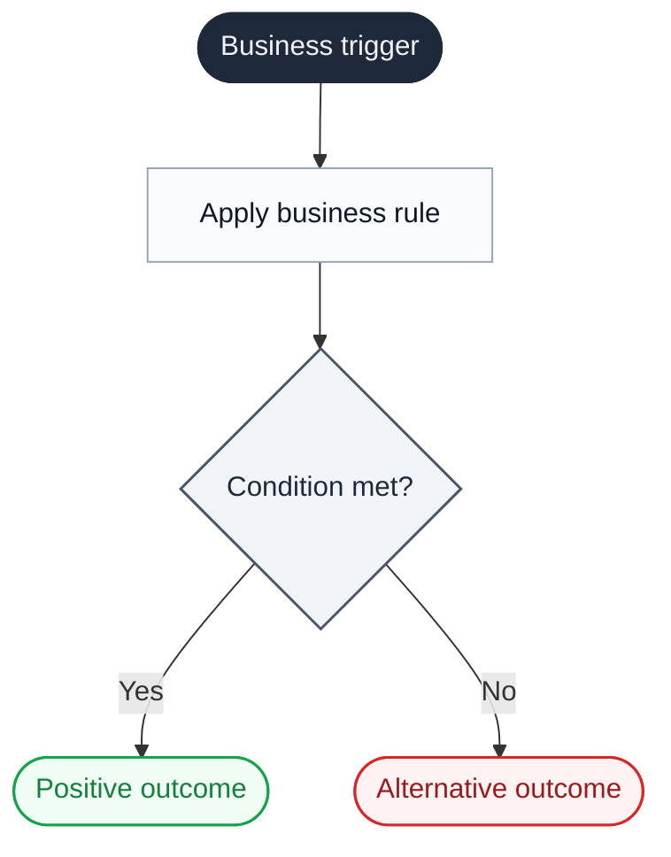

# Business Implementation Report

**Lifecycle:** This document is created **at cycle close**, when the feature is implemented. It does not exist during requirements or design phases. Path: `docs/features/<feature>/report.md`.

Explains completed work in **business language** so reviewers can validate whether it matches the original need.

Rules:

- Pick one report type: `business-flow` (one feature/process) or `system-narrative` (a subsystem).
- Business prose contains no code identifiers, file paths, classes, or implementation jargon.
- Use the project glossary for canonical terms. Create an ad-hoc glossary if none exists.
- Resolve open questions before publishing. Record only hypotheses and limitations with business-visible consequences.
- Code traceability lives **only** in the appendix.

## 1. Frontmatter

```yaml
---
report_type: business-flow | system-narrative
scope:
  - <path-or-scope>
language: <en|es|...>
generated_at: <ISO 8601>
glossary_version: <path-or-sha | ad-hoc>
code_commit: <sha | blank if not a git repo>
---
```

## 2. Executive Summary

3-5 sentences in domain language. Cover: initial need, who is affected, what was implemented, business outcome supported, what reviewers should validate. No mechanics.

## 3. Anchor Diagram

One Mermaid diagram. Use `flowchart` for `business-flow`; `flowchart LR` with subgraphs, `block-beta`, or `C4Context` for `system-narrative`. Palette and classDef: see [`utils-skills/mermaid-diagrams/references/style.md`](../../skills/utils-skills/mermaid-diagrams/references/style.md).



Diagram rules: domain terms only (never code identifiers); every branch labeled; every threshold has units.

## 4. Body

### For `business-flow`

**What was implemented** — what problem it addresses, when it runs, who benefits, what changes when it completes.

**Rules and outcomes**

| Rule | When it applies | Implemented outcome | Business reason |
|---|---|---|---|
| BL1 |  |  |  |

**Calculations, thresholds, labels, exceptions** (include only what applies)

| Item | Business meaning | Implemented behavior | Unit / window / condition |
|---|---|---|---|
|  |  |  |  |

**Examples for validation**

| Scenario | Business input | Implemented outcome | Related rule |
|---|---|---|---|
|  |  |  | BL1 |

### For `system-narrative`

**System intentions** — 3-8 intentions in domain language.

1. **<Intention>** — one sentence on what it enables.

**Each intention in detail** — why it exists, when it activates, what business information it uses, what outcome it produces, how it connects to other intentions.

**System boundaries** — what enters and leaves in business terms; who provides it, who consumes it, consequence if it is delayed, missing, or wrong.

## 5. Hypotheses And Limitations

Only items with business-visible consequences. Resolve open questions before publishing.

| Type | Statement | Business consequence |
|---|---|---|
| Hypothesis |  |  |
| Limitation |  |  |

If none, write: "No known hypotheses or limitations from the available context."

## 6. Appendix — Code Traceability

Development traceability only. Business prose above must not reference this.

| Domain concept | Artifact (PR / spec / module / test / notebook / dashboard) | Location |
|---|---|---|
| <Business trigger> |  | `<path-or-link>` |
| <Business rule> |  | `<path-or-link>` |
| <Business outcome> |  | `<path-or-link>` |

Keep code identifiers here and only here. No line numbers. Prefer the highest-signal artifact per concept.

## Self-Check

- [ ] Report type is `business-flow` or `system-narrative`.
- [ ] Glossary used (project or ad-hoc).
- [ ] Business prose has no code identifiers or file paths.
- [ ] Anchor diagram has `accTitle` and `accDescr`.
- [ ] No open questions remain; hypotheses/limitations are business-visible only.
- [ ] Code traceability appears only in the appendix.
