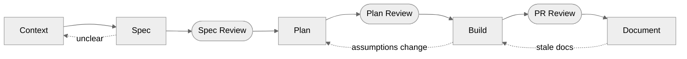

# Lifecycle

How to develop features with AI: the phases, what you do at each step, how to leverage AI agents, and when to gate progress.

This guide is for **developers** working in this framework. It assumes you use Cursor agents as collaborators and that you have already read the theory guides in [`guides/theory/`](../theory/) — in particular [spec-driven-development.md](../theory/spec-driven-development.md) and [context-engineering.md](../theory/context-engineering.md). If you are setting up tools for the first time, start with [ai-configuration.md](ai-configuration.md).

## Core Flow



Five phases flow left to right. Three human review stops guard progress between phases — a person approves the spec, the plan, and the PR before work continues (see [Human Review](#human-review)).

When an arrow loops back, stop and resolve before pushing forward. Review stops exist to catch these disconnects.

> [!TIP]
> For complex work, use **one phase per session**. A single session spanning Context through Build is often too long for reliable reasoning. Clear between phases.

Not every task needs the full process. See [Adapt The Cycle To Your Style](#adapt-the-cycle-to-your-style).

---

## Research (Pre-cycle, optional)

**When:** you lack foundational knowledge to spec or plan confidently — a technology you haven't used, an unfamiliar domain, or a concept a senior engineer would know by instinct.

**How:**

- **Ask a more experienced teammate.** A short conversation with someone who knows the technology saves hours of wrong-direction exploration.
- **Explore with AI in a separate session.** Open an independent Cursor chat with no project docs loaded. Ask freely, follow tangents, and use [`/grill-me`](../../skills/utils-skills/grill-me/) to test your understanding until concepts click. Keep this session isolated — it is exploration, not implementation.

**Done when:** you could explain the approach to a colleague. Move to Context.

---

## Context

**What you do:** Understand the task before asking the AI to change anything.

Start with a quick classification:

| Question | Why it matters |
|---|---|
| Is this a bug, a tweak, a new feature, or research? | Determines the workflow weight |
| What is the blast radius? | Guides how much context to load |
| Are business rules, data contracts, or security involved? | Flags where extra rigor is needed |
| Do we already know what success looks like? | If not, prioritize Spec over Build |

Then load context in layers — only as deep as the task needs:

| Layer | Source | Load when |
|---|---|---|
| **Framework** | `AGENTS.md`, `agent-kit/agent-rules/` | Always |
| **Project** | `docs/docs-guide.md`, `docs/architecture.md`, `docs/glossary.md` | Task touches the project domain |
| **Feature** | `docs/features/<feature>/{specs,plan,CHANGELOG}.md` | Task touches an existing feature |
| **Session** | `.local-context/` | You have handoff notes or partial work |

See [managing-context.md](managing-context.md) and [../theory/context-engineering.md](../theory/context-engineering.md) for the full model.

**Skills:**

- [`context-load`](../../skills/utils-skills/context-load/) — automates loading of project and feature context

**Model suggestion:** Balanced default (Sonnet 4.6, GPT-5.4, Gemini 3.1 Pro). Higher effort only if the project docs are very large or ambiguous (Opus 4.7, GPT-5.5, Gemini 2.5 Pro thinking).

**Exit criteria:**

- [ ] Task type identified (bug / feature / research / docs)
- [ ] Risk level assessed (low / medium / high)
- [ ] Relevant docs loaded and understood
- [ ] Blocking questions surfaced, not ignored

---

## Spec

**What you do:** Define what changes and why. This is where you — the developer — provide the intent. The spec is the source of truth for the rest of the cycle.

Cover:

- problem statement and goals
- current vs target behavior
- what is **out of scope** (as important as what is in scope)
- acceptance criteria — must be **observable** (a test, a notebook output, a before/after diff)
- at least one concrete input/output example
- assumptions and open questions

```text
docs/features/<feature>/
├── specs.md           ← the spec lives here (Spec phase)
├── plan.md            ← created in Plan
├── report.md          ← created at cycle close
└── CHANGELOG.md       ← updated throughout
```

See [../theory/spec-driven-development.md](../theory/spec-driven-development.md) for the full SDD approach.

**Skills:**

- [`make-glossary`](../../skills/skills-for-docs/make-glossary/) — creates or refreshes `docs/glossary.md` before vocabulary-heavy specs
- [`grill-me`](../../skills/utils-skills/grill-me/) — adversarial interview that challenges the spec against existing domain docs and updates the glossary inline
- [`spec-write`](../../skills/skills-for-planning/spec-write/) — synthesizes the conversation into `specs.md`; grounds vocabulary in `docs/glossary.md` and examples in real domain entities from the codebase; flags glossary gaps as open questions

**Model suggestion:** Stronger model (Opus 4.7, GPT-5.5, Gemini 2.5 Pro thinking). Spec quality determines everything downstream. Higher reasoning effort helps surface hidden assumptions.

**Exit criteria:**

- [ ] Problem and goals named
- [ ] Non-goals listed (scope is bounded, not just stated)
- [ ] At least one concrete input/output example
- [ ] Acceptance criteria are observable
- [ ] Assumptions and open questions surfaced
- [ ] The spec answers *why*, not just *what*
- [ ] Human review completed — domain expert or lead approves `specs.md`

---

## Plan

**What you do:** Decide how to build it. The plan translates the approved specs into approach, contracts, evidence strategy, and executable slices.

Define:

- technical approach and contracts
- slices of work (small, vertical, dependency-ordered)
- evidence strategy (tests, notebook outputs, quality checks)
- documentation impact (which docs will need updating)
- known risks and assumptions

**Skills:**

- [`plan-write`](../../skills/skills-for-planning/plan-write/) — translates approved specs into `plan.md`: approach, contracts, test strategy, risks, and ordered task slices; classifies each slice AFK or HITL; optionally publishes to the tracker

**Model suggestion:** Stronger model (Opus 4.7, GPT-5.5, Gemini 2.5 Pro thinking). Architectural decisions and tradeoffs benefit from higher reasoning effort.

**Exit criteria:**

- [ ] Technical approach approved (by you or a reviewer)
- [ ] Slices defined in dependency order
- [ ] Evidence strategy chosen
- [ ] Documentation impact listed
- [ ] Human review completed — technical lead approves `plan.md`

---

## Build

**What you do:** Implement in small, reviewable slices. One cohesive behavior per slice.

Prefer:

- vertical slices over horizontal layers
- clear contracts between components
- explicit tests or evidence per slice
- low drift from the approved spec

If an assumption breaks during implementation, stop and loop back to Plan (or Spec). Do not "fix it in post."

**Skills:**

- [`build-slice`](../../skills/skills-for-planning/build-slice/) — TDD implementation loops per task slice in `plan.md`
- [`notebook-mockup`](../../skills/skills-for-planning/notebook-mockup/) — validates feature logic with synthetic data before writing production code

**Model suggestion:** Balanced coding model for routine implementation (Sonnet 4.6, GPT-5.4, Gemini 3.1 Pro). Stronger model for complex logic, data contracts, or security-sensitive work (Opus 4.7, GPT-5.5, Gemini 2.5 Pro thinking).

**Exit criteria (per slice):**

- [ ] Slice behavior works (tests pass, notebook runs, observable output)
- [ ] Drift from spec is explicit (documented, not hidden)
- [ ] Slice is reviewable (small diff, clear scope)
- [ ] No unrelated changes mixed in
- [ ] Human review completed — reviewer assigned to the PR approves diff + docs

---

## Document

**What you do:** Close the cycle by updating durable knowledge.

> [!WARNING]
> Nothing is done if the code is correct but the docs are stale. A future developer (or a future AI) will trust the docs, not your chat history.

Typical updates:

| What | Where |
|---|---|
| Specs change | `docs/features/<feature>/specs.md` |
| Plan change | `docs/features/<feature>/plan.md` |
| Behavior change narrative | `docs/features/<feature>/CHANGELOG.md` (under `[Unreleased]`) |
| Business validation | `docs/features/<feature>/report.md` (at cycle close) |
| New vocabulary | `docs/glossary.md` |
| Project knowledge | `docs/architecture.md`, `docs/docs-guide.md` |

**Skills:**

- [`context-update`](../../skills/utils-skills/context-update/) — steps through each artifact (including glossary deltas) and applies changes with your confirmation
- [`business-reports`](../../skills/skills-for-docs/business-reports/) — generates business-facing reports at cycle close
- [`pr-summary`](../../skills/skills-for-docs/pr-summary/) — generates a structured PR description for the human reviewer

> For a wholesale glossary rebuild, run [`make-glossary`](../../skills/skills-for-docs/make-glossary/) in the **Spec** phase — not at cycle close.

**Model suggestion:** Fast/cheap model (Haiku 4.5, GPT-5.3 Instant, Gemini 3 Flash). Documentation is mechanical — no need for high reasoning effort.

**Exit criteria:**

- [ ] Durable docs updated
- [ ] Reconciliation check passed (see [managing-context.md](managing-context.md#before-the-commit-reconcile))

---

## Human Review

Three human review points guard the lifecycle. They are not AI phases — a person reads the artifact and approves it before the next phase begins.

| When | What is reviewed | Who |
|---|---|---|
| **Post-Spec** | `specs.md` — scope, ACs, business rules | Domain expert or lead |
| **Post-Plan** | `plan.md` — approach, slices, evidence strategy | Technical lead |
| **Post-Build** | PR diff + [`pr-summary`](../../skills/skills-for-docs/pr-summary/) — implementation, tests, docs | Reviewer assigned to the PR |

No phase advances without human sign-off at the required level.

---

## Adapt The Cycle To Your Style

The five-phase cycle is a reference — not a straightjacket. Many tasks are smaller and don't need the full process. Use what helps, skip what doesn't.

Each developer finds their own rhythm. Some work best with a tight spec-first approach, others iterate faster with a lightweight pass and expand when ambiguity appears. The cycle works both ways. Adapt it.

**Standard mode** — the full cycle. Use it when the task has real behavior change, moderate complexity, or you want the assurance of a spec and a plan before building.

**Lightweight mode** — skip Spec and Plan, jump from Context straight to Build. Great for obvious small fixes, docs changes, experiments, or when you have a clear mental model and just need the AI to execute. Still update docs at the end.

There's no wrong choice. The wrong move is using a mode that doesn't fit the task — like writing a full design doc for a one-line fix, or skipping the spec on a change that affects customer billing. Fit the cycle to the work, not the other way around.

---

## Anti-patterns

### Process

- Coding before the expected behavior is clear
- Treating planning as optional on multi-step work
- Claiming completion without evidence
- Leaving durable decisions only in chat
- Mixing unrelated changes into one slice
- Skipping context because "the AI already knows this project"
- Pushing through a review stop instead of looping back

### Model usage

- Using a strong model for mechanical work
- Using a weak model for spec or security work

---

## Related Guides

- [ai-configuration.md](ai-configuration.md) — tool setup, permissions, models
- [managing-context.md](managing-context.md) — context layers, loading, reconciliation
- [../theory/spec-driven-development.md](../theory/spec-driven-development.md) — SDD deep dive
- [../theory/context-engineering.md](../theory/context-engineering.md) — context window management
- [../theory/skills.md](../theory/skills.md) — reusable AI workflows
- [../theory/subagents.md](../theory/subagents.md) — context isolation and parallel delegation
- [`agent-kit/agent-rules/core.md`](../../agent-kit/agent-rules/core.md) — engineering principles
