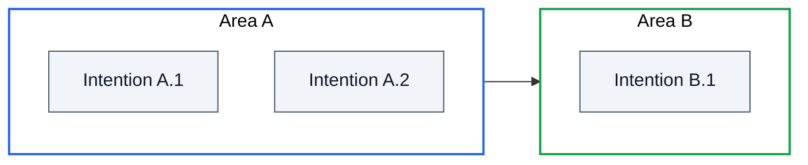

# Diagrams — selection guide for business reports

**All Mermaid syntax, exemplars, palette, and type-specific rules live in [`utils-skills/mermaid-diagrams/`](../../../utils-skills/mermaid-diagrams/SKILL.md)** — that skill is the single source of truth. Read it first.

This file is the **selection guide specific to business reports**: which type earns its place for each report type, and the few overlays the business/mixed register adds on top.

---

## Anchor diagrams per report type

| Report type | Mandatory anchor (§3) | Acceptable alternatives |
|---|---|---|
| `business-flow` | Flowchart | None — the feature is a decision graph by definition. |
| `system-narrative` | Intention map (see below) | `block-beta` if layering carries information; `C4Context` if the focus is system boundaries. |

The anchor is mandatory. Diagrams in §4 are free cardinality — use judgment, default conservative.

---

## When each type earns its place in a business report

| Type | Use it when |
|---|---|
| Flowchart | Decisions, conditional logic, step-by-step feature walks. Anchor of `business-flow`. |
| State (`stateDiagram-v2`) | Entity lifecycles — bookings, requests, approval processes. Use in §4.3 of `business-flow` if the feature has explicit states. |
| Sequence (`sequenceDiagram`) | Actor-over-time interactions where order matters and a flowchart would lose the choreography. |
| Intention map | Anchor of `system-narrative` (pattern below). |
| C4Context | System boundaries — what's inside, what's outside, who interacts. Used in `system-narrative` boundaries section. |
| C4Container | Rare in `business-flow`. In `system-narrative`, inside `
` when zooming into technical structure. |
| Block-beta | Layered / spatial architectures where the shape carries information. Almost always inside `
` in `mixed`. |
| ER | When the data model is part of the story (*"this system is fundamentally a CRM for X"*). Cap at 5-12 principal entities. |
| Architecture-beta | Cloud topology. Almost exclusively inside `
` — a business reader doesn't care about service names. |
| Mindmap | Hierarchical concept maps where the story is *what something covers*, not how pieces talk. Pick mindmap over intention map only when there's no notion of "area" with internal items — just a tree of concepts. |

For syntax, exemplars, and per-type rules of each, see [`mermaid-diagrams/references/diagrams.md`](../../../utils-skills/mermaid-diagrams/references/diagrams.md).

---

## Intention map — business-reports pattern

The intention map is **not in `mermaid-diagrams`**; it's a composition pattern this skill owns. Anchor of `system-narrative`.

Shape: `flowchart LR` with one `subgraph` per business area. Inside each subgraph, one node per intention. Subgraphs use white fill, black text, and a distinct stroke colour per area. Edges between subgraphs only if areas genuinely interact; otherwise leave them edge-free.

**Pick intention map over mindmap when** areas group internal items and need distinct stroke colours. **Pick mindmap over intention map when** the story is a flat concept tree with no internal grouping.

---

## Business-register overlays

On top of the generic Mermaid rules in `mermaid-diagrams`, the business and mixed registers add these:

- **Actor names in sequence diagrams are business roles** (*"Customer"*, *"Reception"*, *"Finance"*), never service or class names.
- **State transition labels are business events** (*"Customer cancels"*, *"Payment received"*), never method calls.
- **C4Context: the system being documented stays a single node** — internal structure belongs in the report body, not in the boundary diagram.
- **Diagrams inside `
` only when genuinely technical** (architecture-beta of cloud services, internal containers). Business-readable diagrams stay outside `
` so the business reader sees them.

All other syntax, palette, edge-label rules, threshold-unit rules, and anti-patterns are the generic Mermaid rules — applied as-is from `mermaid-diagrams`.
