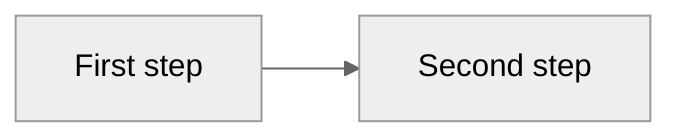

# Mermaid Diagrams

Guide for creating Mermaid diagrams in any document the skill catalog produces: how to pick the right type, how to embed it, and where the formatting rules live.

---

## Pick the right type

The most common mistake is defaulting to flowchart for everything. Match content to type before writing a line.

| Use case | Type | Keyword |
|---|---|---|
| Data model / schema / entity relationships | ER | `erDiagram` |
| Layered system architecture (containers, contexts) | C4 | `C4Container` / `C4Context` |
| Cloud infrastructure / named services / topology | Architecture | `architecture-beta` |
| Spatial or component layout | Block | `block-beta` |
| Workflow / decision logic / conditional branches | Flowchart | `flowchart` |
| Temporal interactions between actors / API calls | Sequence | `sequenceDiagram` |
| State machine / object lifecycle | State | `stateDiagram-v2` |
| Concept hierarchy / topic breakdown | Mindmap | `mindmap` |

Read [`references/diagrams.md`](references/diagrams.md) for the exemplar and type-specific rules of the chosen type.

### Ambiguous cases — disambiguator

When two types feel plausible, apply the rule that matches the *primary* question the diagram answers:

| Tempted to use… | Switch to… | When | Rationale |
|---|---|---|---|
| Flowchart | Sequence | The story is *who talks to whom over time*, not *what decision happens* | Flowchart hides actors; sequence makes the timeline explicit |
| Flowchart | State | Boxes describe *what the entity is*, not *what is being done* | Confusing "doing X" with "being in state X" produces unreadable flowcharts |
| C4 | Architecture-beta | Components are *named cloud services* (S3, Lambda, RDS), not logical processes | C4 is identity-agnostic; architecture-beta gives you icons-as-meaning |
| C4 | Block | The system has a recognisable *shape* (layers, bands, columns) | Block tells the structural story; C4 tells the wiring story |
| Mindmap | C4-Context | The reader needs to see *how pieces talk*, not *what is covered* | Mindmap has no edges-with-meaning; if there is flow, it is the wrong type |

**Anti-pattern**: defaulting to `flowchart TD` for anything that involves boxes. Stop, re-read the table above.

### Outside the catalog

For `gantt`, `kanban`, `pie`, `radar`, `sankey`, `timeline`, `class`, `xychart-beta` — use a dedicated tool, not Mermaid.

---

## Embedding a Mermaid block

Inside any Markdown document, fence the diagram with ```` ```mermaid ````:

````markdown

````

`accTitle` / `accDescr` are screen-reader hooks. They are required for the types that support them (ER, flowchart, sequence, state). C4 uses its own `title` directive instead. For types that do not parse them cleanly (architecture-beta, block, mindmap), place an italic caption just above the block: *"Diagram comparing X, Y, Z."*

---

## Style and syntax rules

All rules — `theme: neutral` frontmatter, the ban on `%%{init}` and inline `style`, `snake_case` node IDs, the two-class `classDef ok/ko` catalog, subgraph styling, edge labels, threshold units — live in [`references/style.md`](references/style.md). That file is the single source of truth; this skill does not restate them.

---

## Verify before delivering

- [ ] Right type chosen — checked the disambiguator, not defaulted to flowchart
- [ ] Diagram complies with every rule in [`references/style.md`](references/style.md)
- [ ] `accTitle` + `accDescr` present (or italic caption for the two types that do not parse them)

---

## References

| File | What it covers |
|---|---|
| [`references/diagrams.md`](references/diagrams.md) | 8 diagram types — exemplars and type-specific rules |
| [`references/style.md`](references/style.md) | Mermaid syntax and style rules — canonical source for the whole catalog |

---

## Document templates with embedded Mermaid

Pre-built Markdown templates for full documents that complement the agent-kit workflow (`agent-kit/AGENTS.md`). Use as a starting point when the goal is a complete document, not a standalone diagram. Each template links back to [`references/style.md`](references/style.md) for Mermaid rules.

| Template | When to use | Mermaid embedded |
|---|---|---|
| [`templates/decision_record.md`](templates/decision_record.md) | ADRs / RFCs — decisions that need context, options compared, and rationale preserved | Yes (before/after architecture) |
| [`templates/pull_request.md`](templates/pull_request.md) | Optional PR archive as a persistent file (`docs/project/pr/` only if enabled in `docs/docs-guide.md` §3); default kit uses `pr-summary` + feature `CHANGELOG.md` | Yes (architecture impact) |
| [`templates/how_to_guide.md`](templates/how_to_guide.md) | Tutorials, runbooks, onboarding walkthroughs — verifiable step-by-step | Yes (process overview) |
| [`templates/project_documentation.md`](templates/project_documentation.md) | Main project README or `docs/index.md` — quick start, architecture, contribution guide | Yes (architecture + request lifecycle) |

> Templates for feature artefacts (`specs.md`, `plan.md`, `report.md`, `architecture.md`, etc.) live in `agent-kit/skeletons/` — not here. Embed Mermaid blocks in those skeletons using the rules above.

---

## Related skills

- [`business-reports`](../../skills-for-docs/business-reports/SKILL.md) — heaviest consumer; its selection guide in [`references/diagrams.md`](../../skills-for-docs/business-reports/references/diagrams.md) points back here for syntax.
- [`plan-write`](../../skills-for-planning/plan-write/SKILL.md) — plans often embed flowcharts or sequence diagrams to explain the approach.
- [`spec-write`](../../skills-for-planning/spec-write/SKILL.md) — specs may include high-level decision flows or system context diagrams.
