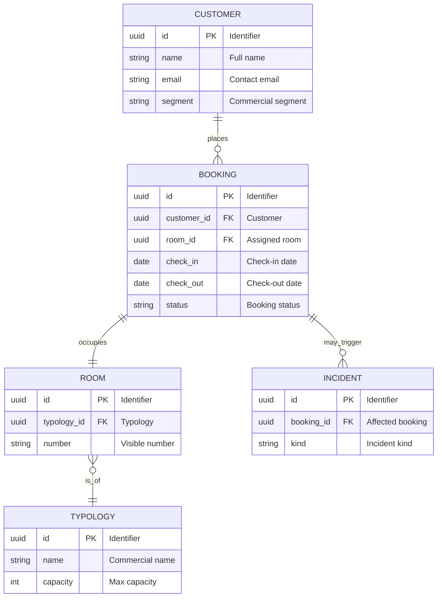
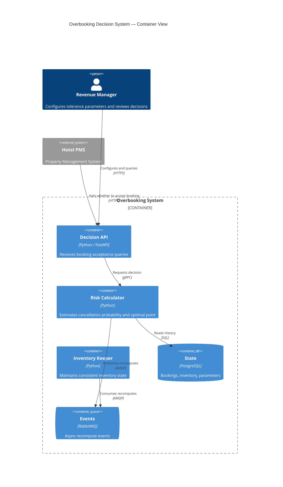
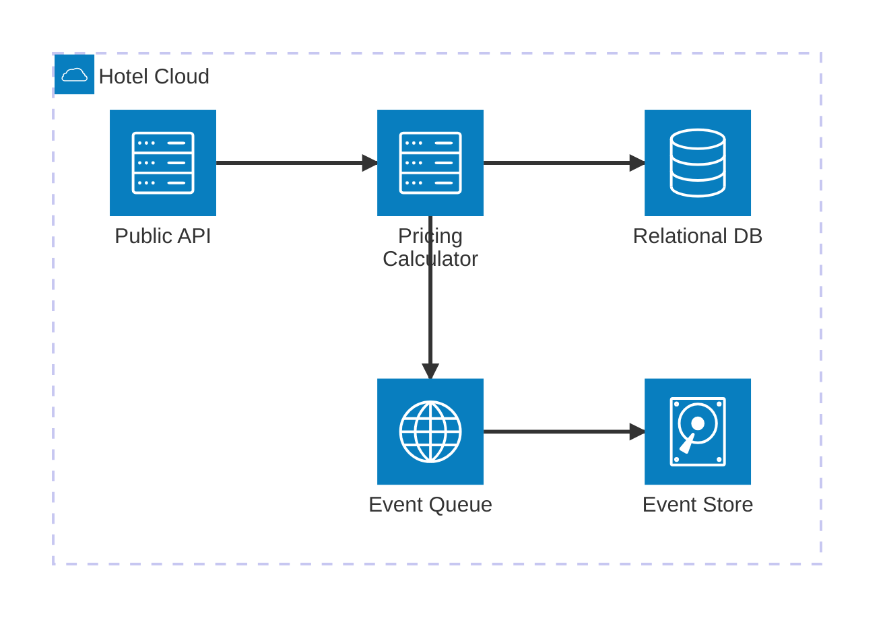
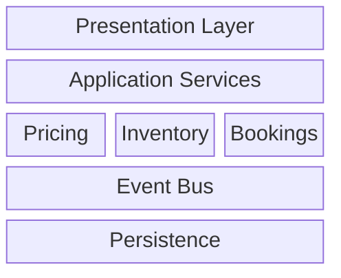
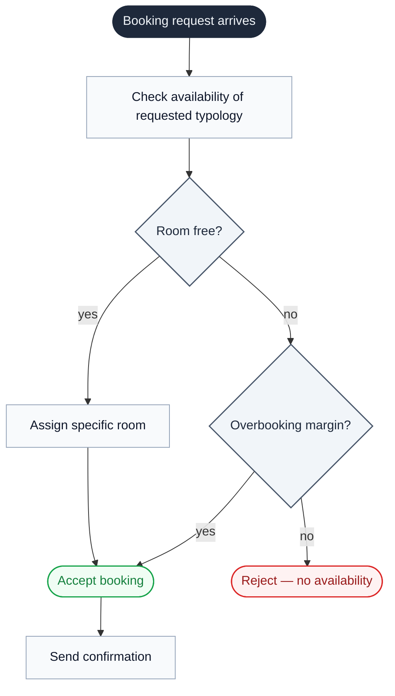
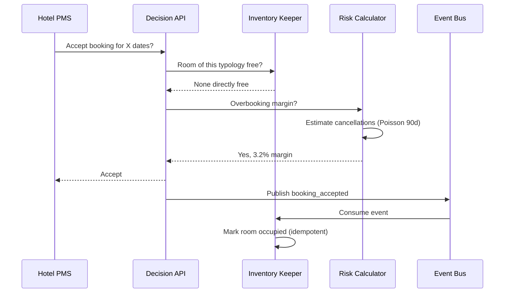
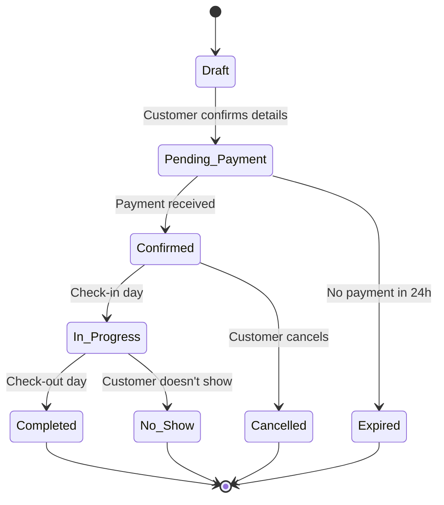
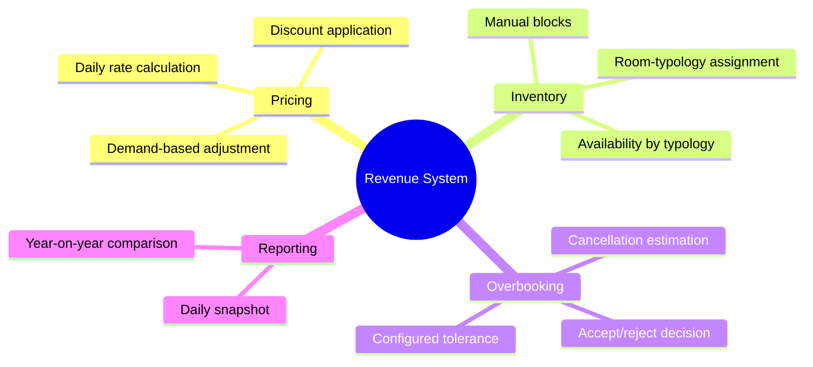

# Diagrams — the eight types this skill covers

Catalog of the eight Mermaid diagram types covered by this skill, with exemplar templates. **General Mermaid rules** (`accTitle`, no `%%{init}`, no inline `style`, `snake_case` IDs, max one emoji per node, no identifier names in labels, edge labels on decisions, `classDef` use) live in `references/style.md`. Read that first; this file lists only type-specific notes on top.

| Diagram | Keyword | Primary use |
|---|---|---|
| ER | `erDiagram` | Data models, entities, relationships |
| C4 | `C4Container` / `C4Context` | Layered system architecture |
| Architecture-beta | `architecture-beta` | Cloud topology with named services |
| Block | `block-beta` | Geometric / spatial layout |
| Flowchart | `flowchart` | Processes, decisions, conditional flows |
| Sequence | `sequenceDiagram` | Temporal interactions between actors |
| State | `stateDiagram-v2` | Lifecycles, state machines |
| Mindmap | `mindmap` | Hierarchical concept maps |

---

## ER — Entity Relationship

**For**: data models, domain entities, their relationships.
**Anti-use**: class hierarchies with methods (use `class`), processes (use `flowchart`).

**Type-specific:**
- **Cardinalities**: `||--o{` one-to-many, `||--||` one-to-one, `}o--o{` many-to-many. `o` = zero or more, `|` = exactly one. Relationship verbs as quoted strings.
- **Scope rule**: only **principal domain entities** — typically 5-12. Auxiliary tables (joins, logs, audit, translations) grouped or omitted. A 30-box ER doesn't read.

---

## C4 — Container and Context

**For**: layered architecture. Container is the most common level for "what pieces, how they talk"; Context for "where the system ends".

**Type-specific:**
- **Conventions**: `Person()` for humans, `System_Ext()` for external systems, `Container()` for your components, `ContainerDb()` for databases, `ContainerQueue()` for queues/buses. `Rel()` with action verb and tech/protocol.
- **Level**: Container as default. If a specific component deserves zoom, add a `C4Component` separately — **don't change the top-level view**.

---

## Architecture-beta — Cloud topology

**For**: when the system is really a topology of named cloud services (S3, Lambda, RDS, etc.) and C4 expresses it worse than icon-bearing boxes.

**Type-specific:**
- **Anti-pattern**: using `architecture-beta` when what you have is really *application* (logical processes), not *topology* (named physical services). If component differentiation is semantic more than technical, go back to `C4Container`.

---

## Block — Geometric layout

**For**: when **spatial arrangement** matters (layers, columns, areas), not the flow between pieces.

**Type-specific:**
- **Pick block over C4** when the system has a layered or banded shape the reader recognizes by form (classical three layers, CQRS columns, platform functional bands). If the system is flat (five services at the same level), C4 tells it better.

---

## Flowchart — Process and decision flows

**For**: process steps, decisions with branches, conditional logic. Most versatile type.

**Type-specific:**
- **Actions begin with a verb**: *"Check availability"*, *"Apply discount"*. Not nouns.
- **Start and end as `()` or `(([...]))`** so they look visually distinct from intermediate actions.

---

## Sequence — Temporal interactions

**For**: how several actors/components talk over time. Natural type for *"what happens when a request comes in"*.

**Type-specific:**
- **Conventions**: `->>` synchronous message, `-->>` response or async message. `participant` declared at the top in left-to-right order.
- **Activations (`activate`/`deactivate`) only when they add information** — most diagrams don't need them.

---

## State — State machines

**For**: an entity's lifecycle with event-triggered transitions.

**Type-specific:**
- **State names** in `Snake_Case` or `Title Case`. Transitions labeled with their triggering event.
- **Don't mix** automatic transitions with event-driven ones without marking them (*"30 days"*, *"automatic"*).

---

## Mindmap — Concept hierarchy

**For**: hierarchically organized concepts without a linear flow between them.

**Type-specific:**
- **Pick mindmap over C4-context or block** when you're showing *what something covers* (concepts/intentions), not *how it's structured* (components). If the reader needs to see how pieces talk, mindmap is the wrong type — use C4 or block.

---

## Types not covered by this skill (and why)

To remove temptation:

- **`class`** — class hierarchies with methods. Out of scope for this skill's documentation focus.
- **`gantt`** — timelines with dependencies. Use a project management tool instead.
- **`pie`, `xychart-beta`, `radar-beta`, `sankey`, `treemap`** — **data** diagrams, not **structure**. For aggregate metrics use a real charting tool (Matplotlib, Vega, Recharts).
- **`timeline`, `gitGraph`, `packet`, `requirement`, `quadrant`, `user_journey`, `kanban`** — niche types out of scope here.
- **`zenuml`** — programming-syntax alternative to sequence. Brings implementation jargon to the diagram; prefer sequence.

If you need one of these, don't add it as Mermaid in this skill's documents — use the appropriate dedicated tool.
